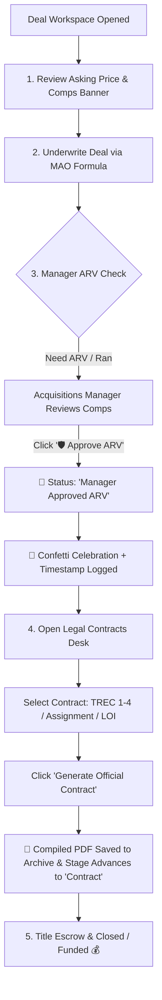

# 🏢 ApexAcquire CRM — Complete System Workflow & AI Engine Guide
*Executive Overview & Step-by-Step Acquisition Flow for Real Estate Investors, Wholesalers & Acquisitions Teams*

---

## 📑 Executive Summary
**ApexAcquire CRM** is an enterprise-grade, end-to-end real estate acquisitions and outreach automation platform. It turns cold Texas realtors, off-market property owners, and digital ad respondents into closed, under-contract deals through automated multi-channel messaging, real-time AI conversation extraction & grading, a Podio-style deal underwriting desk, and a GoHighLevel-inspired 3-column contact CRM.

```
┌─────────────────────────┐     ┌─────────────────────────┐     ┌─────────────────────────┐
│   1. Multi-Channel      │     │  2. Outreach Pipeline   │     │  3. AI Lead Grading     │
│   Marketing & Inbound   │ ──► │  (5-Touch Cadence +     │ ──► │   (0–100 Live Score:    │
│ (WhatsApp/FB/IG/Email)  │     │   30-Day Nurture Loop)  │     │   HOT / WARM / COLD)    │
└─────────────────────────┘     └─────────────────────────┘     └─────────────────────────┘
                                                                             │
                                                                             ▼
┌─────────────────────────┐     ┌─────────────────────────┐     ┌─────────────────────────┐
│     6. Closed Deal      │ ◄── │   5. Under Contract     │ ◄── │  4. AI Deals Pipeline   │
│     & Wire Transfer     │     │ (TREC / Assignment Doc) │     │ (Underwrite MAO & ARV)  │
└─────────────────────────┘     └─────────────────────────┘     └─────────────────────────┘
```

---

## Part 1: Lead Ingestion & Omnichannel Marketing Suite

Leads enter the system through high-converting acquisition channels integrated directly into the **Marketing Hub**:

* **WhatsApp Cloud API:** Official Meta WhatsApp Business API integration supporting 1-on-1 direct messaging, dynamic template merge tags (`{{first_name}}`, `{{realtor_name}}`, `{{brokerage}}`), inbound webhook listeners, and automated 24/7 AI bot replies.
* **Facebook & Instagram Lead Ads Sync:** Real-time webhook listener connecting Meta Lead Forms directly to the CRM. Instantly ingests seller contact details, property street address, asking price, and selling timeline with live Cost Per Lead (CPL) telemetry.
* **Cold Texas Realtor Outreach Lists:** Batch importing 1,000+ licensed agents filtered by county (Dallas, Tarrant, Collin, Denton) and brokerages (Compass, Ebby Halliday, Keller Williams, eXp).
* **Direct Webhook Listeners & Zapier / Make.com:** Universal JSON endpoint for landing page forms, Typeform surveys, and external direct mail campaigns.
* **Campaign Planner & Calendar:** Visual multi-channel calendar for scheduling batch SMS broadcasts, email newsletters, and off-market buy-box updates.

All incoming contacts land immediately in the **Contacts Directory** and are automatically enrolled into the **Outreach Pipeline**.

---

## Part 2: The Outreach Pipeline & 5-Touch Cadence Engine

The Outreach Pipeline guarantees that **no realtor or motivated seller is ever left behind or forgotten**.

```
[1. Queued for Outreach]
          │
          ▼
[2. Outreach Sent] ──► (5-Touch Cadence Sequence: Touch 1/5 → 5/5)
          │
          ├──► [Realtor Replies / Positive Intent] ──► [3. Responded / Qualifying] ──► [4. Lead Created]
          │                                                                                    │
          │                                                                                    ▼
          │                                                                           (Cloned to AI Deals)
          │
          └──► [No Reply after 5 Touches]
                       │
                       ▼
          [5. 30-Day Nurture Loop (Soft Market Touches)]
                       │
                       ▼ (After 30 Days)
          [Auto-Recycled Back to "Queued for Outreach"]
```

### 1. The 5-Touch Cadence Sequence:
When a realtor is enrolled, the background engine dispatches a timed sequence crafted specifically for Texas real estate agents:
* **Touch 1 (Day 1 - Intro & Criteria):** Proof of Funds & Buy Box criteria announcement (single-family, cosmetic to heavy rehab, Dallas-Fort Worth metroplex).
* **Touch 2 (Day 3 - Value Proposition):** Fast 10–14 day cash close, zero financing contingencies, As-Is purchase benefits.
* **Touch 3 (Day 6 - Pocket Listings & Commission):** Inquiring about off-market pocket listings with full buyer-side / double-ending commission protection.
* **Touch 4 (Day 10 - Capital Allocation Alert):** Reminding agent that $2.5M+ in private cash capital is currently allocated for immediate deployment.
* **Touch 5 (Day 15 - Final Breakup):** Polite final check-in before transitioning to soft nurture.

### 2. The 30-Day Nurture Loop (Zero Lead Wastage):
If an agent does not respond after all 5 touches:
* The contact automatically transitions into the **30-Day Nurture Loop**.
* Receives low-pressure bi-weekly market updates and recent closed comps.
* After 30 days, the contact is **automatically recycled** back to `Queued for Outreach` with a fresh conversational angle.

---

## Part 3: AI Lead Grading & Temperature Scoring Engine

When a seller or realtor responds via WhatsApp, SMS, or Email, the **Conversational AI (GPT-4o)** dynamically parses the incoming message in real time across **4 Core Underwriting Criteria (0–100 Points)**:

```
┌────────────────────────────────────────────────────────────────────────┐
│                      AI 4-CRITERIA SCORING MATRIX                      │
├─────────────────────────┬──────────────┬───────────────────────────────┤
│ Criteria                │ Weight (Pts) │ What AI Looks For             │
├─────────────────────────┼──────────────┼───────────────────────────────┤
│ 1. Seller Motivation    │   35 Points  │ Urgency: Probate, Foreclosure,│
│                         │              │ Divorce, Relocation, Landlord │
├─────────────────────────┼──────────────┼───────────────────────────────┤
│ 2. Price Flexibility    │   30 Points  │ Willingness to sell at 20-30% │
│                         │              │ cash discount / negotiable    │
├─────────────────────────┼──────────────┼───────────────────────────────┤
│ 3. Speed to Close       │   20 Points  │ Timeline: Fast close < 14 days│
├─────────────────────────┼──────────────┼───────────────────────────────┤
│ 4. Property Condition   │   15 Points  │ As-Is state, roof/HVAC leaks, │
│    & Clear Title        │              │ foundation issues, no liens   │
├─────────────────────────┴──────────────┴───────────────────────────────┤
│ TOTAL SCORE: 0 to 100 Points                                           │
└────────────────────────────────────────────────────────────────────────┘
```

### Dynamic Temperature Tiers:
* **🔥 HOT LEAD (Score 80–100 / Grade A):** High motivation + deeply discounted asking price + fast timeline. Immediate push notification & sound alert sent to Acquisitions Manager. Lead is automatically cloned into the **AI Deals Pipeline**.
* **⚡ WARM LEAD (Score 50–79 / Grade B):** Realtor has an off-market property but requires price discovery. Task scheduled for specialist follow-up.
* **❄️ COLD LEAD (Score 25–49 / Grade C):** Retail pricing or no immediate urgency. Retained in automated follow-up.
* **💀 DEAD LEAD (Score < 25 / Grade D):** Wrong number, non-agent, or DND requested. Automatically moved to terminal archive.

---

## Part 4: Handling Real-World Messy & Short Messages

Clients rarely send structured information. ApexAcquire handles real-world conversational variations through **Progressive Entity Extraction & Contextual Memory**:

```
┌──────────────────────────────────────────────────────────────────────────────────┐
│                             REAL-WORLD CONVERSATION FLOW                         │
├──────────────────────────────────────────────────────────────────────────────────┤
│ Turn 1 (Inbound):                                                                │
│ Realtor: "Hey, I have a property at 4812 Bordeaux Ave asking $1.45M."            │
│                                                                                  │
│ AI Extraction:                                                                   │
│ • Address: 4812 Bordeaux Ave, Highland Park TX                                   │
│ • Asking Price: $1,450,000                                                       │
│ • Initial Score: 52/100 (WARM)                                                   │
│                                                                                  │
│ AI Autonomous Bot Response:                                                      │
│ "Thanks Sarah! We have all-cash capital ready for Highland Park. To finalize our │
│ best number, what is the property condition (roof, HVAC, interior) & timeline?"  │
├──────────────────────────────────────────────────────────────────────────────────┤
│ Turn 2 (Inbound):                                                                │
│ Realtor: "Probate estate, original 1980s condition, roof is old. Heirs want it   │
│ closed in 14 days clean cash."                                                   │
│                                                                                  │
│ AI Score Adjustment:                                                             │
│ • Motivation: Probate estate (+35 pts)                                           │
│ • Property Condition: Needs full rehab (+15 pts)                                 │
│ • Speed to Close: 14 days (+20 pts)                                              │
│ • Price Flexibility: Open to cash offer (+20 pts)                                │
│                                                                                  │
│ Updated Score: 🔥 94/100 (HOT LEAD / Grade A)                                   │
│ Action: Deal Created & Cloned into Deals Desk + Push Alert to Acquisitions Lead! │
└──────────────────────────────────────────────────────────────────────────────────┘
```

---

## Part 5: Podio-Style AI Deals & Offers Table Desk

* **Architecture:** Structured Podio-style database list table with a dedicated left filter views sidebar (**strictly NO kanban / NO drag-and-drop**).

### Key Table Capabilities:
1. **Left Views & Preset Filters:**
   * **Team vs. Private Views:** Toggle between global acquisitions pipeline and private specialist deals.
   * **Quick Filters:** `Need Manager ARV`, `Under Contract`, `Closed & Funded`, and filter by assigned Specialist.
2. **Top 3-Button Interactive Toolbar:**
   * 🗂️ **View Density Mode:** Toggle between **Comfortable Mode** (spacious cards & large tags) and **Compact Mode** (high-density financial scanning).
   * 🎚️ **Column Settings Customizer:** Checkbox controls to toggle visibility of any of the 9 table columns (`Index`, `Address`, `Date Created`, `Specialist`, `Manager Check ARV`, `Stage`, `Temperature`, `Asking Price`, `Realtor`) + **Reset All** default button.
   * 🔍 **Advanced Pipeline Filters:** Multi-criteria filter modal for Stage, Manager ARV Status, Temperature Tier, and Numeric Asking Price Range ($Min to $Max) with an active blue dot indicator.
3. **High-Contrast Financial Display:**
   * **Realtor Asking Price** is rendered in a **high-contrast bold blue font** so it is never confused with ARV or MAO calculations.
   * **Manager ARV Badges:** 🔵 `Manager Approved ARV`, 🟡 `ARV RAN`, ⚪ `Need Manager ARV`.

---

## Part 6: Deal Detail Workspace (Underwriting, ARV Approval & Legal Contracts)

Clicking any deal opens the dedicated, full-screen **Deal Detail Workspace**:



### 1. Financial Underwriting & MAO Formula:
$$\text{MAO} = \text{Estimated ARV} - \text{Estimated Rehab} - \text{Closing Costs} - \text{Target Wholesale Spread}$$
* Real-time sliders and inputs for ARV, Rehab, Holding Costs, and Target Spread.

### 2. Role-Based Manager ARV Approval:
* Dedicated to **Managers** and **Admins**.
* 1-Click `🛡️ Approve` button updates status to `Manager Approved ARV`, logs the manager's name and exact date/time stamp, launches a full-screen celebratory confetti animation, and records the event in the immutable Activity Timeline.

### 3. 1-Click Legal Contract Generation:
* Generates official **TREC 1-4 Family Resale Purchase Agreements**, **Wholesale Assignment Agreements**, or **Letters of Intent (LOI)**.
* Auto-populates earnest money deposit, inspection contingency days, closing timeline, and designated title company (*Republic Title DFW*).
* Automatically updates the deal stage to **`Contract`** and compiles a downloadable PDF record in the contracts archive.

---

## Part 7: 3-Column Contact CRM Desk (GoHighLevel / Revora Architecture)

The **Contact Detail Page** provides a complete 3-column command center:

```
+----------------------------------------------------------------------------------------------------+
│                                      TOP EXECUTIVE BAR                                             │
│ [<- Back to Contacts]  Sarah Jenkins  [Hot Lead]  ID: #cnt-101   [Edit Contact] [Call Agent] [Inbox] │
+-----------------------------+---------------------------------------+------------------------------+
│ COLUMN 1: CONTACT PROFILE   │ COLUMN 2: CONVERSATIONS & CHAT        │ COLUMN 3: ASSOCIATIONS PANEL │
│-----------------------------+---------------------------------------+------------------------------│
│ • Avatar & Contact Header   │ • Sub-Tabs: Conversations/Calls/Tasks │ • Associations Header (+Add) │
│ • Owner & Followers         │ • Voice AI & Missed Call Banner       │ • 7-Icon Interactive Toolbar │
│ • Tags Manager (+Add Tag)   │ • Live SMS / Email Message Feed       │ • Companies (1) (+Add)       │
│ • Action Pills (All/DND/Act)│ • Bottom Composer + Send Button       │ • Deals in Pipeline (3)(+Add)│
│ • Expandable Accordions:    │                                       │ • Interactive Tool Views     │
│   - Contact Information     │                                       │   (History, Tasks, Settings, │
│   - Realtor Info            │                                       │    Calendar, Contracts)      │
│   - Wholesaler Info         │                                       │                              │
│   - Contract Generation     │                                       │                              │
│   - General Info            │                                       │                              │
+-----------------------------+---------------------------------------+------------------------------+
```

* **Column 1 (Left):** Identity, tags manager, DND toggle, field search filter, and 5 expandable accordions.
* **Column 2 (Center):** Sub-tabs for `💬 Conversations`, `📞 Calls (2)` (with audio player and duration logs), and `☑️ Tasks (3)`, Voice AI banner, and direct SMS/Email message composer.
* **Column 3 (Right):** Top 7-Icon Toolbar (🕒 History, 🗂️ Associations, 🔧 Settings, ✏️ Edit Contact, ☑️ Tasks with `◯` to `✅` toggle, 📅 Next Cadence Calendar, 📄 Contracts Archive with PDF downloads), linked Brokerages, and linked Deals.

---

## Part 8: VoIP Click-to-Call Dialer & Voice AI

* **VoIP Click-to-Call Modal:** 1-click calling directly from any contact or deal card. Features live call timer, call script suggestions, mute/hold/hangup controls, and automatically pauses the AI Bot during active voice calls to prevent conflicting SMS messages.
* **Call Recording Logs:** Inbound and outbound audio recordings stored with duration and time stamps.

---

## Part 9: Role-Based Access Control (RBAC) & Governance

| Role | Permitted Pages | Unique Authorities & Capabilities |
|---|---|---|
| **ADMIN** | All pages | Full system configuration, team user management, API keys, compliance audit log inspection, ARV overrides. |
| **MANAGER** | All pages | **Primary authority to click `🛡️ Approve ARV`**, assign deals to specialists, reassign tasks, export pipeline reports. |
| **AGENT / SPECIALIST** | Dashboard, Outreach, Deals, Conversations, Tasks, Contacts, Marketing, Templates | Conduct outreach, chat with realtors, calculate underwriting, draft deals, execute tasks. *(Settings & system audit logs restricted).* |
| **READ_ONLY** | Dashboard, Outreach, Deals, Conversations, Contacts, Marketing, Reports | View-only inspection for outside capital partners and supervisors. *(Mutating actions disabled).* |

---

## Part 10: Summary of Core Competitive Advantages

1. **100% Automated Realtor Outbound:** Dispatches hundreds of tailored Texas realtor messages weekly without manual effort.
2. **Instant AI Qualification:** Autonomous GPT-4o extraction captures addresses, asking prices, conditions, and calculates 0–100 scores in seconds.
3. **Zero Lead Wastage:** 5-touch cadence followed by the 30-day nurture loop recycles non-responsive leads back into active pipeline.
4. **Institutional Underwriting:** Podio-style table and Deal Workspace with MAO formula, manager ARV sign-off with confetti feedback, and 1-click legal contracts.
5. **GoHighLevel 3-Column Efficiency:** Unified contact CRM with VoIP dialer, 7-icon tool views, expandable accordions, and bidirectional deep linking.
6. **Executive Obsidian & Sapphire Interface:** High-contrast, clean typography, zero clutter, and complete operational transparency.

*(End of Presentation Guide)*
